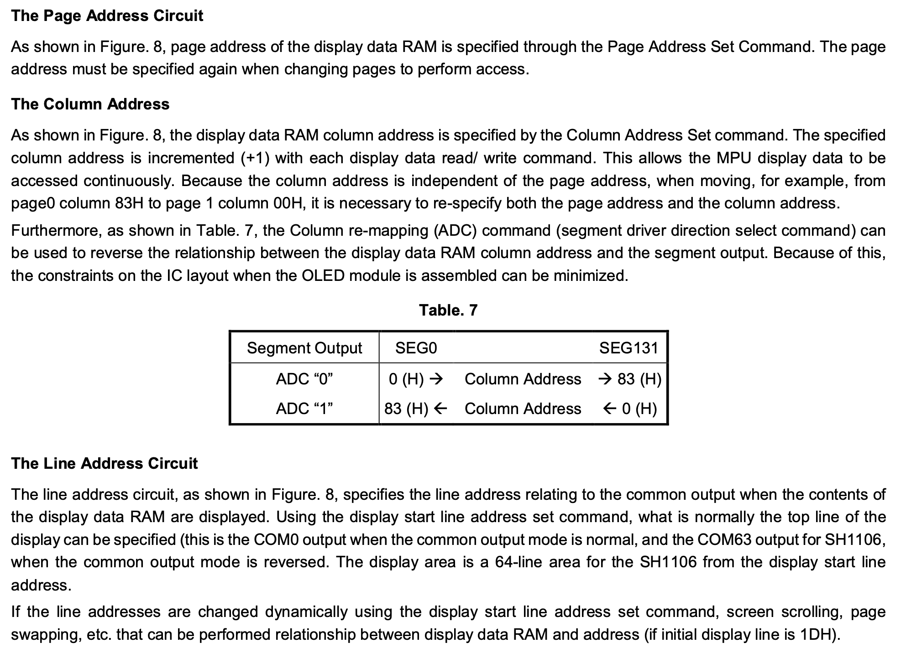

<p align="center">

</p>

## SH1106 OLED Display

The SH1106 is a 1.3 inch OLED display that has 128 x 64 visible pixels, but 132 x 64 bits of SRAM. It is very similar to the SSD1306 display, with 2 major differences:

  1. The 128 x 64 visible OLED pixels are centered within the 132 x 64 bits of SRAM. Pixel (2,0) in SRAM corresponds to pixel (0,0) on the display.
  2. The SH1106 only supports page-addressing mode. There is no horizontal- or vertical-addressing mode, like on the SSD1306. This affects how you send the Pi-side buffer to the display over I2C.

----------------------------------------------------------------------
### Step 0: Wiring setup

The SH1106 has 4 pins that connect to the Pi. This is the same as the SSD1306.
  1. Connect `GND` to `GND`.
  2. Connect `VCC` to `3V3`.
  3. Connect `SCK` to `GPIO3`.
  4. Connect `SDA` to `GPIO2`.

The `code` folder includes `sh1106-display-driver-staff.o` and 2 simple programs `0-fill-screen.c` and `1-draw-commands.c` you can use to test your wiring setup and make sure your device hardware doesn't have any issues.

----------------------------------------------------------------------
### Step 1: I2C setup
The `code` folder includes the staff's I2C implementation `i2c.o`.
To drop in your own I2C driver, add it to `COMMON_SRC` and 
remove `PREBUILT_OBJS` from the Makefile.

```
COMMON_SRC := sh1106-display-driver.c
COMMON_SRC += my-i2c.c

# PREBUILT_OBJS := i2c.o
# PREBUILT_OBJS += sh1106-display-driver-staff.o
```

The device address is still `0x3C`.

----------------------------------------------------------------------
### Step 2: Device initialization sequence

The SH1106 datasheet doesn't provide a recommended device initialization sequence, but the SSD1306 initialization sequence is a good guideline.

[SH1106 pg 18] lists the display's default power-on-reset settings.

<p align="center">

</p>

----------------------------------------------------------------------
### Step 3: Page-addressing mode

The SH1106 only supports page-addressing mode, so we must send 1 page at a time via I2C in order to update the display's SRAM with the contents of the Pi-side buffer.

[SH1106 pg 15] describes the page address circuit and how the column address pointer is updated.

<p align="center">

</p>

[SH1106 pg 16] has a diagram showing how the SRAM is organized into pages. Each page is a row of 132 bytes, where each byte represents 8 vertical bits.

<p align="center">

</p>

To send 1 page of data to the device, we follow this sequence:
  1. Reset the column address to 0 by setting the lower and higher bits appropriately [SH1106 pg 19].
  2. Set the page address for page 0, 1, ..., or 7 [SH1106 pg 23].
  3. Send all the data for a single page via I2C using `i2c_write()`. The data must be packed into an array of length 133 bytes, since the first byte must be `0x40` to indicate that we are sending data.

<p align="center">

</p>

<p align="center">

</p>

----------------------------------------------------------------------
### Step 4: Draw commands

Very similar to SSD1306. The main difference is that the 128 x 64 visible OLED pixels are centered within the 132 x 64 bits of SRAM. Pixel (2,0) in SRAM corresponds to pixel (0,0) on the display.

Reference libraries from Adafruit for custom draw commands:
- [Adafruit SSD1306](https://github.com/adafruit/Adafruit_SSD1306/blob/master/Adafruit_SSD1306.cpp): has functions for drawing pixels and lines.
- [Adafruit GFX Library](https://github.com/adafruit/Adafruit-GFX-Library/blob/master/Adafruit_GFX.cpp): has a lot more functions, such as drawing text characters.

Useful draw functions:
- `draw_pixel()`
- `draw_horizontal_line()`
- `draw_vertical_line()`
- `draw_fill_rect()`: draws a filled rectangle, useful for drawing text at different sizes
- `draw_character_size()`: draws an ASCII character at a specified size
