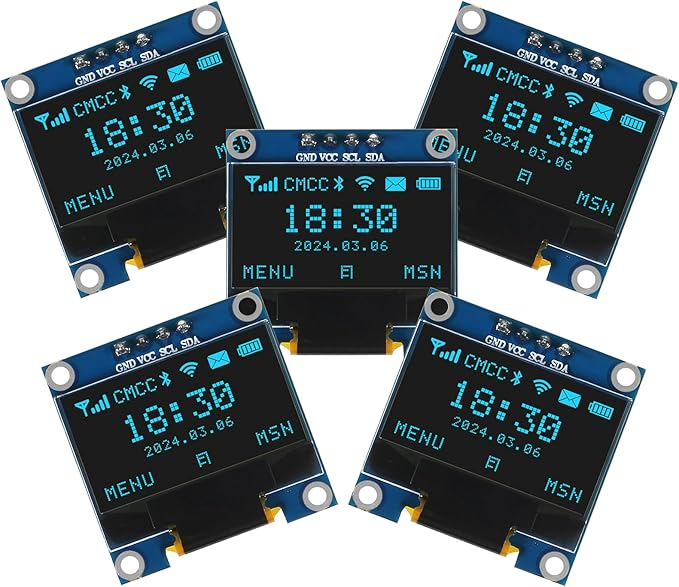
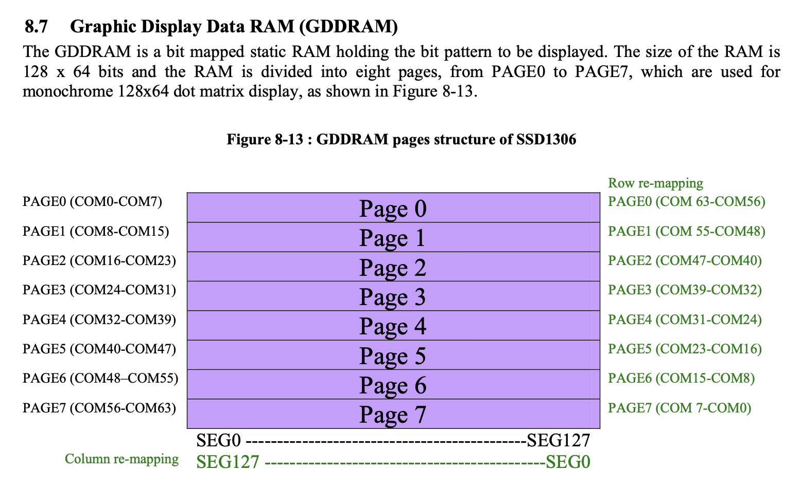
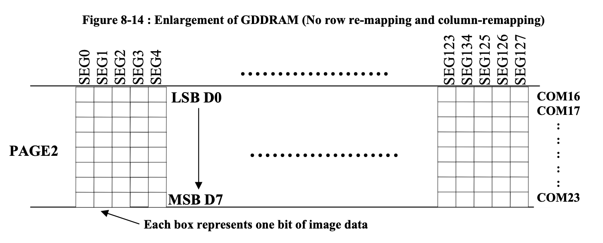
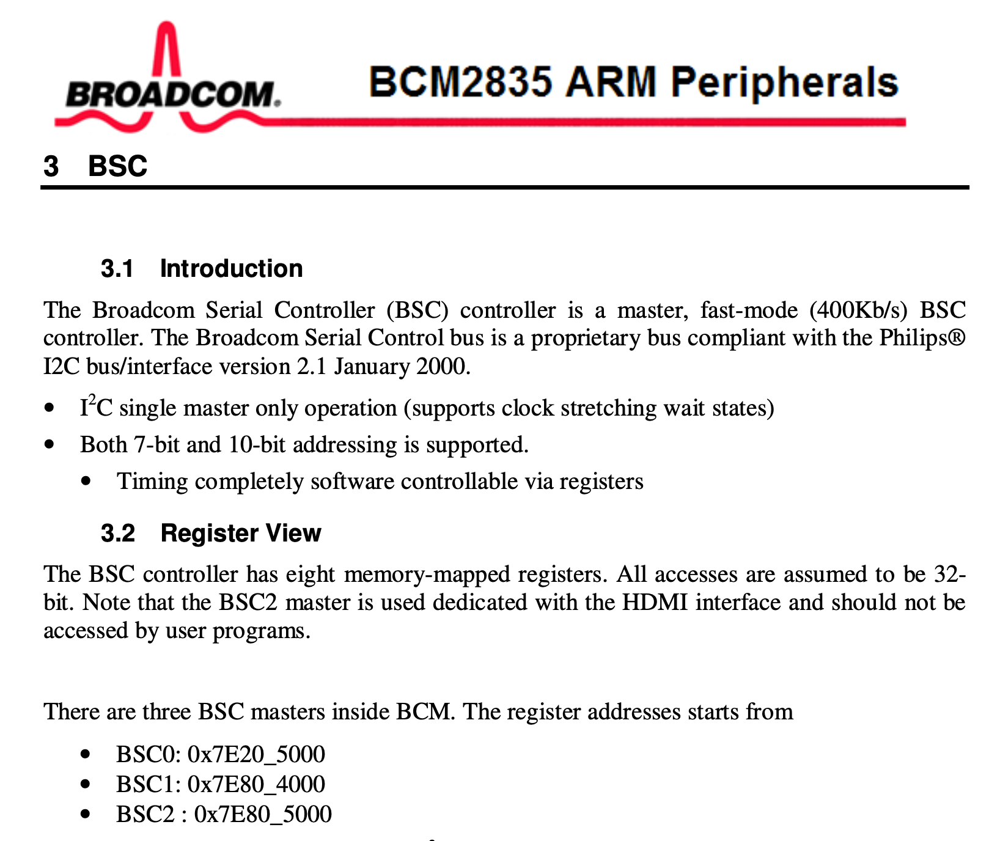
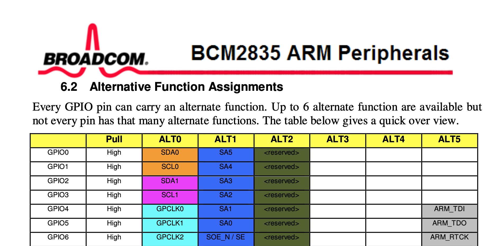
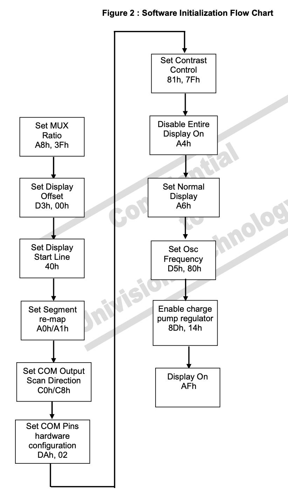

<p align="center">

</p>

## SSD1306 OLED Display

The SSD1306 is a 0.96 inch OLED display that has 128 x 64 pixels.

The overall idea for doing graphics with this display:
- The display has a 128 x 64 bit SRAM display buffer. Each pixel of the screen can either be ON/OFF (no RGB color), so we only need one bit per pixel. The RAM is divided into 8 pages; each page is a row of 128 bytes, and each byte represents 8 vertical pixels.
- On the Pi-side, we have a 128 x 64 bit buffer. We modify this buffer with custom drawing commands, such as `draw_pixel()`, `draw_line()`, and `draw_text()`.
- To show the contents of Pi-side buffer on the display, send the data in the Pi-side buffer over to the display via I2C.

<p align="center">

</p>

<p align="center">

</p>

----------------------------------------------------------------------
### Step 0: Wiring setup
The SSD1306 has 4 pins that connect to the Pi.
  1. Connect `GND` to `GND`.
  2. Connect `VCC` to `3V3`.
  3. Connect `SCL` to `GPIO3`.
  4. Connect `SDA` to `GPIO2`.

- [BCM pg 28] says there are 3 BSC base addresses.
  - Staff I2C uses the BSC1 base address, `0x20804000` on our Pi.

<p align="center">

</p>

- [BCM pg 102] has a table listing alternative function assignments. 
  - SDA (serial data) is for the data signal.
  - SCL (serial clock) is for the clock signal.
  - During I2C setup, the `i2c_init()` function sets up `GPIO2` and `GPIO3` pins to use `ALT0` (alternate function 0), which correspond to `SDA1` and `SCL1` since w use the BSC1 base address.

<p align="center">

</p>

----------------------------------------------------------------------
### Step 1: I2C setup
The `code` folder includes the staff's I2C implementation `i2c.o`.
To drop in your own I2C driver, add it to `COMMON_SRC` and 
remove `PREBUILT_OBJS` from the Makefile.

```
COMMON_SRC := ssd1306-display-driver.c
COMMON_SRC += my-i2c.c

# PREBUILT_OBJS := i2c.o
```

----------------------------------------------------------------------
### Step 2: Device initialization sequence

[SSD1306 pg 64] in the datasheet has a flow chart describing the device initialization sequence.

<p align="center">

</p>

To send a command (a single hex code) to the display via I2C, we need to begin the I2C message with `0x00` to indicate that the next byte in the
message is a command (and not data).

Whenever we call `i2c_write()`, we provide the device address. For this display, `SSD1306_DISPLAY_ADDRESS = 0x3C`. If you look on the back of the display, you should see some text "IIC device address" and solder connecting the center pin to `0x3C`. (You can also change the device address to `0x3D` by changing the solder connection.)

```
void ssd1306_display_send_command(uint8_t cmd) {
  uint8_t cmd_buf[2] = {0x00, cmd};
  i2c_write(SSD1306_DISPLAY_ADDRESS, cmd_buf, 2);
}
```

  **0. Turn off the display [SSD1306 pg 37]**

  This isn't required by the flowchart diagram, but we turn off the display during device initialization to be safe. This is different from the "Entire display on" command, which forces the display on regardless of the contents of the display data RAM.

  **1. Set multiplex ratio. [SSD1306 pg 37]**
 
   The multiplex ratio defines how many lines the display refreshes per cycle. Setting the multiplex ratio is actually a double-byte command. We first send `0xA8` to indicate that we want to set the multiplex ratio. Then, the next command code we send will actually be used to set the multiplex ratio. The flowchart recommends that we use `0x3F` to set the multiplex ratio; this is the default value 63, which corresponds to having all 64 rows of the display active.

   **2. Set display offset [SSD1306 pg 37]**

   The display offset specifies the mapping of the display start line to one of the COMs (rows) 0 to 63. This is another double-byte command.

   **3. Set display start line [SSD1306 pg 36]**
  
   We set the display start line register to determine the starting address of display RAM.

   **4. Set segment re-map [SSD1306 pg 31, 36]**
   
   The segment re-map changes the mapping between the display data column address and the segment driver. [SSD1306 pg 31] explains the 2 options we have; you can choose to map column address 0 to SEG0 (the power-on reset default value) or map column address 127 to SEG0.

   **5. Set COM output scan direction [SSD1306 pg 31, 37]**

   We can set the scan direction of the COM output, either to normal mode or remapped mode. Normal mode is the power-on reset value, where the scan direction goes from COM0 to COM63.  

   **6. Set COM pins hardware configuration [SSD1306 pg 11, 40]**

   This is a double-byte command. [SSD1306 pg 40] lists a bunch of possible COM pins hardware configuration options. Although the flowchart says to use `0x02` to set the configuration, the footnote on [SSD1306 pg 11] says to use `0x12` to set the configuration. I use `0x12` for my initialization sequence.

   **7. Set contrast control [SSD1306 pg 36]**
   
   This is a double-byte command. The chip has 256 contrast steps from `0x00` to `0xFF`.

   **8. Display output according to GDDRAM contents [SSD1306 pg 37]**

   Note: the flowchart calls this step "disable entire display on", but [SSD1306 pg 37] says that the `0xA4` command is used to display output according to GDDRAM contents.

   **9. Set normal/inverse display [SSD1306 pg 37]**

   Choose between using normal or inverse colors.

   **10. Set oscillator frequency [SSD1306 pg 22, 40]**

   This is a double-byte command. [SSD1306 pg 22] has details on the formula.

   **11. Enable charge pump regulator [SSD1306 pg 62]**

   This is a double-byte command. We want to enable the charge pump during display on.

   **12. Specify memory addressing mode [SSD1306 pg 34-36]**

   The flowchart doesn't mention this step, but it's important to set up the memory addressing mode before sending any data to the display over I2C. The SSD1306 supports 3 addressing modes: page addressing, horizontal addressing, and vertical addressing.

   The display has a 128 x 64 bit SRAM display buffer, and we maintain our own 128 x 64 bit buffer on the Pi-side. This is the `uint8_t *display_buffer` defined at the top of `ssd1306-display-driver.c`. 
   
  > Reason for two separate `i2c_buffer` and `display_buffer` variables?
  > When we send the Pi-side buffer to the display via I2C in `ssd1306_display_show()`, we need to begin the I2C message with `0x40` to indicate that we are sending data (and not a command). By defining `display_buffer = i2c_buffer + 1`, we can treat `display_buffer` as the single, contiguous Pi-side buffer of display data; it makes array indexing cleaner later on when writing custom draw functions.

   In the `ssd1306_display_show()` function, we would like to update the display's SRAM buffer by sending over the entire `display_buffer` as a single chunk of contiguous data. To support this, we need to choose *horizontal addressing mode*.
   
   Our display is 128 x 64 pixels, represented by 128 x 64 bits OR 128 x 8 bytes. In this diagram, each PAGE row represents a row of 128 bytes, where **each byte in this row represents 8 vertical pixels**. 
   
   In horizontal addressing mode, after one byte is written to the display SRAM, the column address pointer is increased automatically by 1. If the column address pointer reaches `COL[END]`, it gets reset to `COL[START]` and the page address pointer is incremented by 1. This flow naturally matches the layout of our Pi-side display buffer.

   In order to write to all 8 pages and all 127 columns of the display SRAM, we'll want to set `COL[START] = 0`, `COL[END] = 127`, `PAGE[START] = 0`, `PAGE[END] = 7`.

   Here is the sequence we can follow to accomplish all this:

   - [SSD1306 pg 34, 35]: Set memory addressing mode to horizontal addressing mode; this is a double byte command. We first send `0x20` to indicate that we want to set the memory addressing mode, and then send `0x00` to specify that we want horizontal addressing mode.
   - [SSD1306 pg 35]: Set column addresses; this is a triple byte command that specifies the `COL[START]` and `COL[END]` values. First send `0x21` to indicate that we want to set the column addresses. Then, send `0x00` to set `COL[START] = 0`. Lastly, send `0x7F` to set `COL[END] = 127`.
   - [SSD1306 pg 36]: Set the page addresses; this is a triple byte command that specifies the `PAGE[START]` and `PAGE[END`] values.

  **13. Turn display on [SSD1306 pg 37]**

  We're now ready to turn the display on.

  **14. Clear the screen**

  Lastly, clear the screen and call `ssd1306_display_show()` to complete initialization.

At this point, running the `0-fill-screen.c` program should turn on all pixels of the display!

----------------------------------------------------------------------
### Step 3: Draw commands

In general, drawing programs follow this structure:

```
// 0-fill-screen.c

void notmain(void) {
  // Initialize I2C with some settling time
  delay_ms(100);
  i2c_init_clk_div(1500);
  delay_ms(100);

  // Initialize the display with some settling time
  ssd1306_display_init();
  delay_ms(100);

  // Submit some draw commands
  ssd1306_display_fill_white();

  // Must call this to actually update the display screen
  ssd1306_display_show();

  // Loop infinitely for static display.
  // Or, within the loop, submit more draw commands + call show to update the display.
  while (1) {}
}
```

Reference libraries from Adafruit for custom draw commands:
- [Adafruit SSD1306](https://github.com/adafruit/Adafruit_SSD1306/blob/master/Adafruit_SSD1306.cpp): has functions for drawing pixels and lines.
- [Adafruit GFX Library](https://github.com/adafruit/Adafruit-GFX-Library/blob/master/Adafruit_GFX.cpp): has a lot more functions, such as drawing text characters.

Useful draw functions:
- `draw_pixel()`
- `draw_horizontal_line()`
- `draw_vertical_line()`
- `draw_fill_rect()`: draws a filled rectangle, useful for drawing text at different sizes
- `draw_character_size()`: draws an ASCII character at a specified size
